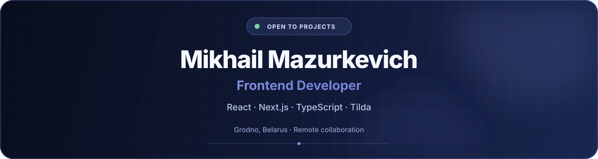

  

  
  
  
  

## About

I'm a frontend developer with **1+ year of hands-on experience**, including a frontend internship at **Itransition** and commercial freelance work. I build responsive websites and web applications with **React, Next.js, TypeScript, and Tilda**.

I work across the full delivery cycle: understanding requirements, estimating tasks, translating Figma designs into responsive interfaces, integrating APIs, testing, and refining the final result. I care about maintainable code, reliable functionality, smooth performance, and UX that feels natural.

> Open to project-based and part-time collaboration with web studios and product teams.

## Experience

### Freelance Frontend Developer · Kwork

`Apr 2026 — Present`

- Build and improve responsive Tilda websites from Figma designs.
- Add custom functionality with HTML, CSS, and JavaScript, including forms and interactive UI.
- Handle requirements, estimates, testing, client feedback, and final delivery.

### Frontend Developer Intern · Itransition

`Jan 2026 — Mar 2026`

- Built two web applications using React, Next.js, TypeScript, and REST APIs.
- Created reusable components and implemented state and data handling.
- Worked with Git, pull requests, code reviews, and clean-code practices.

## Selected Work

### 🍕 NextPizza

A full-featured pizza delivery application with product filtering, cart and checkout flows, multi-provider authentication, email verification, profile management, and order history.

`Next.js 14` `TypeScript` `Prisma` `PostgreSQL` `NextAuth.js` `Tailwind CSS`

### 🚀 Developer Portfolio

A responsive portfolio focused on clear project presentation, modern UI, type safety, SEO, and smooth interface motion.

`Next.js 15` `React 19` `TypeScript` `Tailwind CSS` `Framer Motion`

### 🏦 JustBank

A responsive banking dashboard with transaction history, account statistics, reusable UI components, and account operations.

`JavaScript` `SCSS` `HTML` `Webpack` `Vercel`

## Tech Stack

**Frontend**

**UI & Styling**

**Data, Integrations & Platforms**

**Workflow & Delivery**

## Let's Connect

If you need help with a responsive frontend, a Next.js interface, or a custom Tilda implementation, feel free to reach out.

- [Portfolio](https://mikemaz-portfolio.vercel.app/)
- [Email](mailto:mazurkevich.mikhail.14@gmail.com)
- [LinkedIn](https://www.linkedin.com/in/mike-mazurkevich/)
- [Telegram](https://t.me/mazdev_14)
